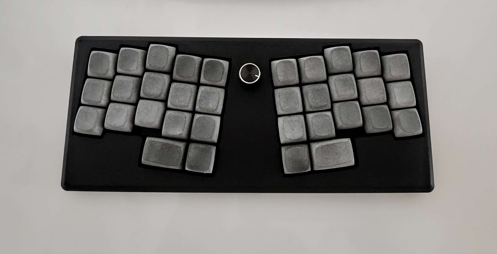

# Le Yiffre

Le Yiffre is a modified hotswap Le Chiffre pcb as an experimental design with different thumb clusters.Thanks to tominabox1 for creating [Le Chiffre Keyboard](https://github.com/tominabox1/Le-Chiffre-Keyboard) and making it open source.

## Description

PCB, 3d case and switch plates tested and works fine. Building one is your own
risk.

## QMK Configuration

Works with le chiffre qmk config.
